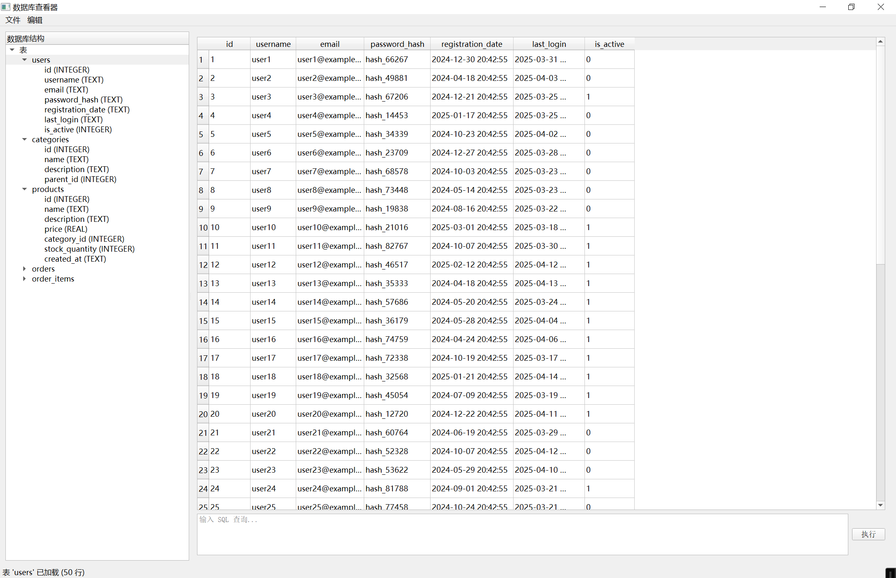

# SQLite Database Viewer

A simple yet powerful SQLite database viewer built with PyQt5. This application allows you to browse, query, and modify SQLite databases with an intuitive graphical interface.

## Features

- **Database Navigation**: Browse tables and their structure in a tree view
- **Data Viewing**: Display table contents in a sortable and editable grid
- **SQL Query Interface**: Execute custom SQL queries directly in the application
- **Data Manipulation**: Add, edit, and delete rows through the UI
- **Transaction Support**: All changes can be committed or rolled back
- **Auto Column Sizing**: Columns are automatically sized based on content

## Installation

### Prerequisites

- Python 3.6 or higher
- PyQt5

### Setup

1. Clone the repository:
   ```
   git clone https://github.com/yourusername/sqlite-dbviewer.git
   cd sqlite-dbviewer
   ```

2. Install dependencies:
   ```
   pip install -r requirements.txt
   ```

## Usage

Run the application:
```
python main.py
```

### Opening a Database
1. Click on "File" → "Open Database" or press Ctrl+O
2. Select your SQLite database file (.db, .sqlite, .sqlite3)

### Viewing Tables
- The left panel shows the database structure
- Click on any table to view its contents
- Table data is displayed in the right panel

### Executing SQL Queries
1. Enter your SQL query in the text area at the bottom
2. Click "Execute" or press Enter to run the query
3. Results will be displayed in the table view

### Editing Data
- Double-click on any cell to edit its value
- Click "Edit" → "Add Row" to insert a new record
- Select rows and click "Edit" → "Delete Selected Rows" to remove records
- Click "File" → "Save Changes" or press Ctrl+S to commit changes to the database

### Refreshing Data
- Press F5 or click "Edit" → "Refresh Current Table" to reload the current table

## Project Structure

- `main.py` - Application entry point
- `dbviewer.py` - Main window and UI logic
- `db_connector.py` - Database connection handling
- `requirements.txt` - Required Python packages

## Screenshots



## License

This project is licensed under the MIT License - see the LICENSE file for details.

## Contributing

Contributions are welcome! Please feel free to submit a Pull Request.
